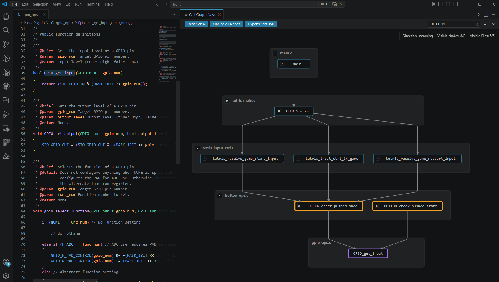
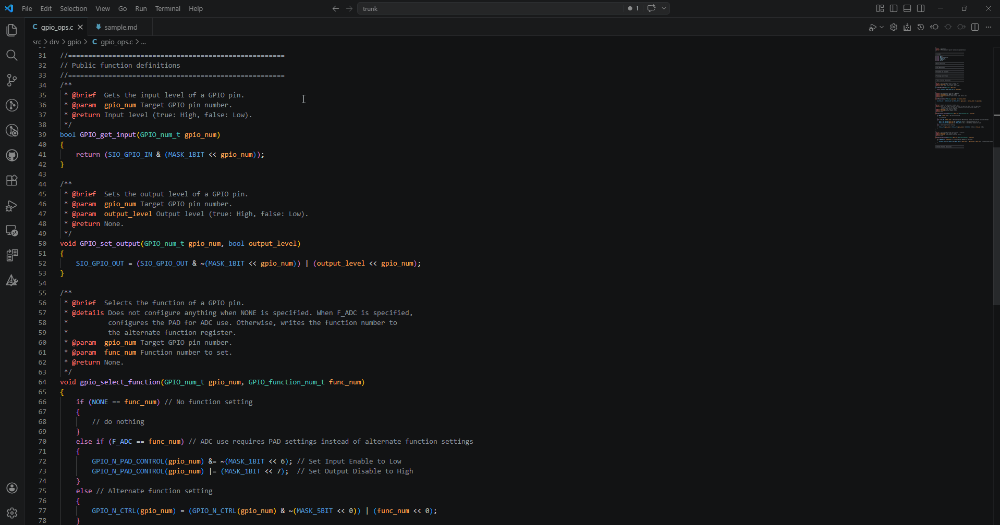

# Call Graph Navi
Visualize function call structures as directional graphs (incoming/outgoing) to better understand your code’s structure. 
Language-agnostic — works with any language that supports Call Hierarchy. (see [Requirements](#requirements))

---

## Demo

---

## Features

### Bidirectional Call Graphs
Visualize call graphs in both directions:
- **Outgoing Call Graph** — Shows functions called by the selected function.
- **Incoming Call Graph** — Shows functions that call the selected function.

### Focused View
Cut out the noise and focus on the call structure you care about.
- Hide individual files or functions by clicking the × icon.
- Right-click a node → "**Show Path to Root**" to display only the path from that node up to the root.

### Jump to Definition
Click any function to jump straight to its definition.

### Graph Export (SVG, PNG, PlantUML)
Click the "Export" button in the top toolbar to export the current graph:
- SVG (**added in v0.3.0**): Exports the current graph as a SVG file.
- PNG (**added in v0.3.0**): Exports the current graph as a PNG file. The resolution can be configured in the extension settings.
- PlantUML: Converts the current graph structure into PlantUML text and copies it to the clipboard.

### Graph Orientation (**added in v0.2.0**)
Choose the display orientation of the call graph: vertical (default) or horizontal. 
This can be configured via the "Graph Orientation" setting in the extension settings.

---

## Getting Started

1. Open a source file in the editor.
2. Place the cursor on the function you want to visualize.
3. Use one of the following:
   - **Context menu (right-click):**
      - **Show Incoming Call Graph**
      - **Show Outgoing Call Graph**
   - **Keyboard shortcuts:**
     - `Ctrl+Alt+Q` — Show Incoming Call Graph
     - `Ctrl+Alt+W` — Show Outgoing Call Graph
   - **Command Palette:**
      - `Ctrl+Shift+P` → `Call Graph Navi: ...`
---

## Requirements
A language server with Call Hierarchy support must be installed and active for the target language (e.g. `ms-vscode.cpptools`, `clangd`, `rust-analyzer`, `Pylance`, `gopls`).

## Known Issues
Rendering large graphs may take longer depending on their size.